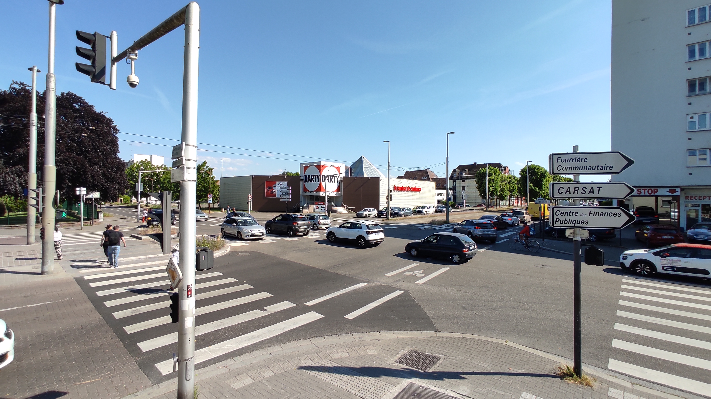
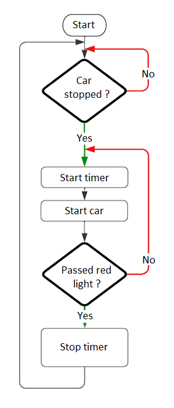
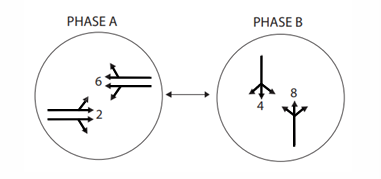
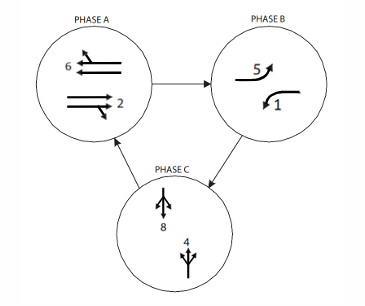

# Traffic Light Optimizaton

This project is based on a previous version of Bilal Himite's [trafficSimulator](https://github.com/BilHim/trafficSimulator) and aims at reducing waiting times at traffic lights by implementing diverse traffic light algorithms.

## Motivations

I quite franckly do not like waiting at red lights, especially in urban zones as they tend to get congestionned and waiting times end up adding to several minutes a day.

I thus began wondering how could traffic lights be improved to reduce waiting time at intersections.

    
     
    <em>Picture of an often congestionned 2-3 ways crossroad near my high school.</em>

The intersection on the picture above is the one I based my work on during this study.

## Gathering and treating data from the simulation

If we want the simulation to be useful to the study, we must add a few features to gather data from its cars.

### Timer algorithm

Because a car can stop several time before passing the red light, we'll make sure to start the timer once the car first stops and only stop it once it has gone past the traffic light.

Note : On the graph below "start timer/car" starts or continues the timer/car depending if the car was already started or not.

    
     
    <em>Timer algorithm</em>

The measured times will then be exported in a .txt file to be treated later on.

### Treating data

`plot_maker.py` is the script responsible for the data treatment.
Its role is to :
- Extract data from the .txt file generated by the simulation during its runtime.
- Associate a car with a position in the queue.
- Average waiting times.
- Plot a histogram of the waiting time as a function of the line and position in the queue.

## Traffic light algorithm

A traffic light algortihm can be represented using a phase diagram (see below) to represent its cycle and show which cars are moving and when. Here, I chose to use to use a 3 phase diagram so as to :
- Reduce the number of conflicting car paths. (See cars turning left and opposing cars going straight for example).
- Try and reduce time given the fact that the real intersection uses a 3-phases cycle.

    

        
         
        <em>2 phases diagram</em>
    

    

        
         
        <em>3 phases diagram</em>
    

 

Source : Ontario Traffic Manual - See bibliography

(WORK IN PROGRESS - Comming Soon)

## Bibliography

[**Ontario Traffic Manual Book 12: Traffic Signals**](https://otc.org/wp-content/uploads/2023/01/OTM-Book-12-Traffic-Signals.pdf.pdf) - Ontario's  Ministry of Transport (2012)

[**Simulating Traffic Flow in Python**](https://towardsdatascience.com/simulating-traffic-flow-in-python-ee1eab4dd20f) - Bilal Himite (2021)

## Getting Started

### Prerequisites

This project requires `numpy`, `pygame`, and `scipy`, and works with Python 3.